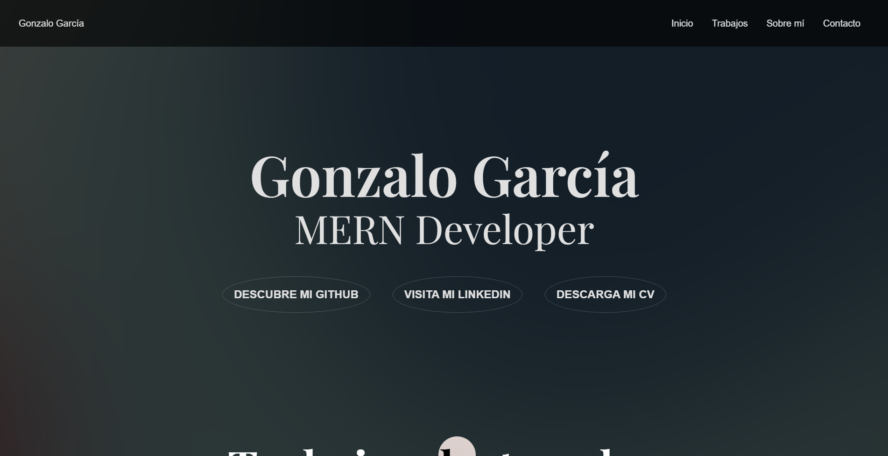

# Portfolio Gonzalo García

## Índice de contenidos

- [Resumen](#Resumen)
- [Hecho con](#Hecho-con)
- [Características](#Características)
- [Contacto](#contacto)

## Resumen

- [Demo](https://www.gonzalo.pro)
- Mi portfolio personal, donde voy colganco mis trabajos.

### Hecho con

- HTML
- CSS
- JavaScript
- PHP

## Características

Este es mi portfolio personal. Actua como un hub en el que se conectan mis proyectos, redes sociales y datos de contacto.
Gracias a él puedo compartir mi progreso con el mundo y mostrar mi aprendizage a otros desarrolladores de la comunidad y potenciales empleadores.

## Contacto

